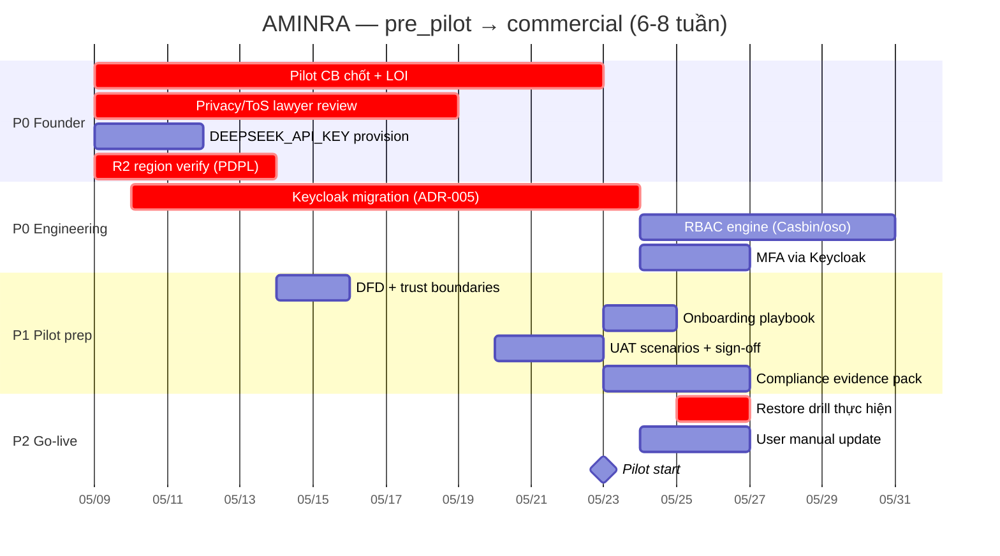

# AMINRA — Halal Certification Platform

> **Status:** `pre_pilot` (2026-05-09) — codebase đủ cho investor demo + pilot 1-2 CB controlled. Commercial launch: 6-8 tuần.

Nền tảng SaaS đa người thuê kết nối doanh nghiệp Việt Nam có nhu cầu chứng nhận Halal với các Tổ chức Chứng nhận (CB), AI hỗ trợ sàng lọc & tự động hoá, blockchain truy xuất nguồn gốc.

## Quick start (dev)

```bash
docker compose up -d
docker compose ps                # Verify all healthy
```

| Service | URL |
|---|---|
| Backend API + Swagger | http://localhost:8100/docs |
| Frontend (DN/CB/Admin portal) | http://localhost:3100 |
| Qdrant | http://localhost:6433 |
| Vault | http://localhost:8200 |

## Stack

FastAPI + Next.js 16 + PostgreSQL (schema-per-tenant) + Qdrant + Redis + arq worker + HashiCorp Vault + OpenRouter (DeepSeek) + Polygon (cert anchor).

ADR cho mỗi decision lớn: `../all-docs/02-Projects/aminra/architecture/adr/`.

## Documentation

| Loại | Vị trí |
|---|---|
| **Brain** (status, tasks, decisions, incidents) | `../all-docs/02-Projects/aminra/README.md` (auto-loaded qua `@import` trong `CLAUDE.md`) |
| **Per-feature spec/threat-model/test** | `docs/features/<feature>/` |
| **Architecture / Security / Operations** | `../all-docs/02-Projects/aminra/{architecture,security,operations}/` |
| **API** | Swagger UI tự động `http://localhost:8100/docs` |
| **Glossary** | `../all-docs/02-Projects/aminra/GLOSSARY.md` |

## Roadmap (snapshot 2026-05-09)



Chi tiết task list: brain Section 2 (`ACTIVE_TASKS`).

## Testing

- 1132 test collected; **720 pass + 242 skip + 0 fail + 0 error** (in-container)
- UAT 184 case cần `HOST_CI=1` (host CI runner)
- Visual regression PDF: `make visual-test`

```bash
docker compose exec aminra-backend pytest -x          # Quick BE
cd frontend/aminra-web && npm test                    # Quick FE
cd frontend/aminra-web && npm run test:e2e            # Playwright
```

## Contributing

Đọc `CONTRIBUTING.md` + `CLAUDE.md` (convention) trước khi PR.

## License

Proprietary — © AMINRA 2026.
